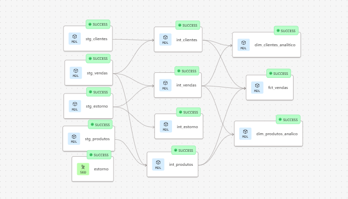

# 🛍️ ShoesBR — Data Warehouse Analítico com dbt + AWS

Projeto de Data Warehouse analítico de um e-commerce fictício (**ShoesBR**), construído do zero utilizando **AWS (VPC + RDS PostgreSQL)** como infraestrutura de dados e **dbt (Core + Cloud)** como ferramenta de transformação, teste, documentação e orquestração.

Este é um projeto de portfólio em Engenharia de Dados, cobrindo um pipeline **End-to-End (E2E)**: desde a infraestrutura em nuvem até o deploy e agendamento automático das transformações.

> ⚠️ Projeto educacional/portfólio. A marca ShoesBR é fictícia.

---

## 🖼️ Diagramas

### Arquitetura do projeto


### Linhagem dos dados (dbt docs / lineage)



---

## 🎯 Objetivo

Construir um Data Warehouse analítico, organizado em camadas conforme as boas práticas do dbt, permitindo análises confiáveis sobre **clientes, produtos, vendas e estornos (reembolsos)**.

O projeto foi desenvolvido com foco em demonstrar, na prática, competências centrais de um Engenheiro de Dados:

- Provisionamento de infraestrutura em nuvem (AWS)
- Modelagem de banco de dados (OLTP → DW analítico)
- Transformação de dados em camadas (ELT)
- Testes de qualidade de dados
- Documentação técnica automatizada
- Versionamento de código
- Deploy e orquestração em produção

---

## 🏗️ Arquitetura

### Infraestrutura (AWS)

```
VPC
 └── Security Group
      └── RDS PostgreSQL
           └── Database: shoesbr
                └── Schema: landing
                     ├── clientes
                     ├── produtos
                     └── vendas
```

### Pipeline de dados (E2E)

```
AWS RDS PostgreSQL (landing)
        │
        ▼
   dbt Sources
        │
        ▼
     Staging (stg_)
        │
        ▼
   Intermediate (int_)
        │
        ▼
  Marts (dim_ / fct_ / report_)
        │
        ▼
  Testes + Documentação (dbt docs)
        │
        ▼
   GitHub (versionamento)
        │
        ▼
   dbt Cloud (deploy)
        │
        ▼
  Job agendado (orquestração)
```

---

## 🧱 Camadas do dbt

### 🔹 Staging (`stg_`)

Camada responsável por padronizar os dados brutos, sem aplicar regras de negócio.

- Nomeação: `stg_<nome_tabela>`
- Seleção explícita de colunas (sem `SELECT *`)
- Padronização em `snake_case`
- Limpeza básica: remoção de duplicatas, tratamento de nulos, conversão de tipos
- Sempre referencia a fonte com `source('shoesbr', 'tabela')`

### 🔸 Intermediate (`int_`)

Camada onde ocorrem os cruzamentos entre entidades.

- Nomeação: `int_<entidade>`
- Joins e enriquecimento entre modelos de staging
- Criação de entidades derivadas e reutilizáveis
- Sempre referencia staging com `ref('stg_xxx')`

### 🟢 Marts

Camada final, voltada para consumo do negócio.

- `dim_` → dimensões (ex: `dim_customer`, `dim_product`)
- `fct_` → fatos (ex: `fct_sales`)
- `report_` → relatórios/KPIs agregados
- Sempre referencia `ref('int_xxx')` ou `ref('dim_xxx')`

### Comparativo

| Aspecto | Staging | Intermediate | Marts |
|---|---|---|---|
| Prefixo | `stg_` | `int_` | `fct_`, `dim_`, `report_` |
| Fonte | `source()` | `ref(stg_)` | `ref(int_)`, `ref(dim_)` |
| Transformação | Limpeza/padronização | Joins/enriquecimento | Métricas/KPIs |
| Complexidade | Baixa | Média | Alta |
| Público-alvo | Engenharia | Engenharia/Analytics | Negócio |

---

## 🧬 Modelo de dados de origem

```
Clientes 1 ──── N Vendas N ──── 1 Produtos
                    │
                    └── Reembolsos (via seed)
```

- `clientes`, `produtos`, `vendas`: carregados diretamente no RDS (schema `landing`)
- `reembolsos`: materializado a partir de um **seed** do dbt (dado estático versionado no projeto)

---

## ⚙️ Recursos técnicos implementados

- ✅ **Sources** — referência formal aos dados brutos no RDS
- ✅ **Seeds** — carga da tabela de reembolsos
- ✅ **Snapshots** — rastreamento de mudanças (schema dedicado `snapshots`)
- ✅ **Macro customizada `generate_schema_name`** — sobrescreve o comportamento padrão do dbt para que o schema definido em `+schema` seja usado de forma literal, sem concatenar com o schema padrão do profile (ex.: `staging` em vez de `analytics_staging`), respeitando uma nomenclatura de schemas já padronizada (`landing`, `staging`, `intermediate`, `marts`, `snapshots`)
- ✅ **Testes genéricos** — `unique`, `not_null`, `relationships`
- ✅ **Documentação** — arquivos `schema.yml` descrevendo modelos e colunas, geração via `dbt docs generate`
- ✅ **Modelagem em estrela** — dimensões e tabela fato na camada marts

---

## ☁️ Deploy e Orquestração

O deploy e a orquestração são feitos via **dbt Cloud** (plano gratuito):

- Repositório versionado no **GitHub**
- Projeto conectado ao **dbt Cloud**, integrado diretamente ao repositório
- **Job de orquestração** (`Orquestração Projeto Shoes BR`) configurado com execução **agendada (Scheduled)**
- Execuções automáticas rodam de forma independente do ambiente local — sem depender de o computador estar ligado

Esse fluxo reproduz, em escala reduzida, o mesmo padrão utilizado em ambientes corporativos, em que a transformação de dados roda em um serviço gerenciado/agendado, e não manualmente por um analista.

---

## 🔧 Stack utilizada

| Camada | Tecnologia |
|---|---|
| Infraestrutura | AWS VPC, AWS RDS (PostgreSQL) |
| Banco de dados | PostgreSQL |
| Cliente SQL | DBeaver |
| Transformação | dbt Core / dbt Cloud (`dbt-postgres`) |
| Versionamento | Git + GitHub |
| Orquestração | dbt Cloud Jobs (agendamento) |
| Ambiente local | Python (venv) |

---

## ✅ Pré-requisitos (ambiente local/replicação)

- Python 3.8+
- Conta AWS (Free Tier) com RDS PostgreSQL
- DBeaver (ou outro cliente SQL)
- Conta no dbt Cloud
- Git
- Conta no GitHub
- `dbt-postgres` (versão 1.9+)

```bash
pip install dbt-postgres
```

---

## 🗂️ Estrutura do projeto

```
shoesbr/
├── models/
│   ├── staging/
│   ├── intermediate/
│   └── marts/
├── seeds/
├── snapshots/
├── macros/
├── tests/
├── dbt_project.yml
├── profiles.yml
└── README.md
```

---

## 📅 Linha do tempo do projeto

```
Sprint 1 — Infraestrutura
✅ VPC, Security Groups, RDS PostgreSQL
✅ Banco shoesbr + schema landing
✅ Tabelas criadas e populadas
✅ Ambiente Python (venv) + dbt-postgres
✅ dbt inicializado e profiles.yml configurado
✅ Conexão validada (dbt debug)

Sprint 2 — Staging
✅ Sources
✅ Seeds
✅ Modelos staging (stg_)
✅ Testes de qualidade

Sprint 3 — Intermediate
✅ Joins e enriquecimento
✅ Entidades derivadas (int_)

Sprint 4 — Marts
✅ Dimensões (dim_)
✅ Fato (fct_)
✅ Macro generate_schema_name
✅ Snapshots

Sprint 5 — Documentação e Deploy
✅ dbt docs gerado
✅ Repositório no GitHub
✅ Projeto conectado ao dbt Cloud
✅ Job de orquestração agendado
```

---

## 🚀 Próximos passos (fora do escopo desta versão)

Itens conscientemente deixados para um projeto futuro mais avançado:

- Colunas de metadados de ingestão (`ingestion_timestamp`, `source_system`, `load_batch_id`)
- Containerização com Docker
- Pipeline de CI/CD (GitHub Actions)
- Modelos incrementais
- SCD Tipo 2 completo
- Orquestração externa (Airflow) e deploy em serviços como ECS/Fargate

---

## 👟 Sobre o projeto

Projeto educacional desenvolvido para prática de Engenharia de Dados com dbt e AWS. A marca **ShoesBR** é fictícia, criada exclusivamente para fins de estudo e portfólio.